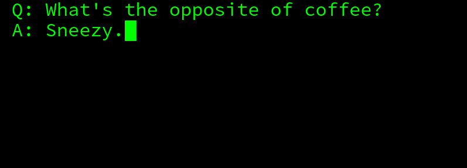

# Web Phosphor
JS rewrite of Phosphor Xscreensaver




## Usage

The `src/index.html` is a full example. This loads online resources and then start the **WebPhosphor** like this:
``` js
new WebPhosphor(function getTextCallback() {
    return 'Coffee is the most important meal of the day';
});
```


## Offline usage

This stuff has been prepared for offline environment too!

For this you should run an `npm install` and after that you will
find the offline bundle in the `build` directory.
